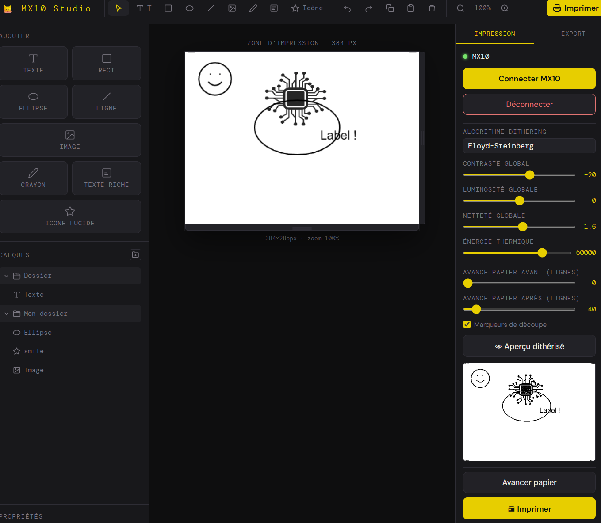

# 🐱 CatPrinter Studio

**CatPrinter Studio** est une interface web permettant de créer et d'imprimer des documents sur une mini imprimante thermique Bluetooth Cat Printer (CatPrinter et modèles compatibles), directement depuis le navigateur — sans installation, sans driver.

> Basé sur les travaux de [NaitLee/kitty-printer](https://github.com/NaitLee/kitty-printer)

---

## Aperçu



CatPrinter Studio offre un éditeur visuel de type « canvas » avec calques, un pipeline de dithering configurable et une connexion Bluetooth directement depuis Chrome ou Edge via l'API Web Bluetooth.

---

## Fonctionnalités

### Éditeur de mise en page
- **Blocs** : Texte, Texte riche (éditeur WYSIWYG), Rectangle, Ellipse, Ligne, Image, Dessin à main levée (crayon), Icônes vectorielles Lucide
- **Calques** avec gestion de la visibilité, ordre Z, renommage inline, et organisation en **dossiers**
- **Sélection, déplacement, redimensionnement** à la souris avec poignées
- **Propriétés** éditables par bloc (police, couleur, épaisseur, opacité…)
- **Zoom** et redimensionnement libre du canvas (largeur et hauteur)
- **Undo / Redo** complet
- **Copier / Coller** de blocs
- Raccourcis clavier (`V`, `T`, `R`, `E`, `L`, `P`, `X`, `K`, `Ctrl+Z/Y/C/V`, flèches…)

### Icônes Lucide
- Bibliothèque complète d'icônes [Lucide](https://lucide.dev/) chargée à la demande
- Picker avec recherche instantanée et prévisualisation
- Rendu vectoriel natif sur canvas (sans SVG externe)

### Impression thermique
- Connexion **Web Bluetooth** (Chrome / Edge uniquement / Brave (si bluetooth activé))
- Algorithmes de dithering : **Floyd-Steinberg**, **Atkinson**, **Ordered Bayer**, **Seuil simple**
- Réglages globaux : contraste, luminosité, netteté, énergie thermique
- Avance papier avant et après impression
- **Aperçu dithérisé** avant envoi
- **Marqueurs de découpe** optionnels
- Centrage horizontal automatique selon la largeur de la zone d'impression
- Barre de progression et journal d'activité

### Export
- Export PNG de la mise en page (384 px, sans dithering)

---

## Compatibilité imprimantes

Modèles testés ou supposés compatibles (via le service UUID `0000ae30-...`) :

| Marque | Modèles |
|--------|---------|
| Cat Printer | MX05, MX06, MX08, **CatPrinter** |
| GB | GB01, GB02, GB03 |
| Generic | GT01, YT01 |

> La largeur d'impression est **384 pixels** — contrainte matérielle fixe de la CatPrinter.

---

## Utilisation

### Prérequis

- **Google Chrome** ou **Microsoft Edge** (Web Bluetooth requis)
- Une imprimante compatible allumée et en mode appairage Bluetooth

### Lancement

Aucune installation requise. Il suffit d'ouvrir `catprinter-studio.html` dans Chrome/Edge :


### Workflow typique

1. **Créer la mise en page** dans l'éditeur (blocs texte, images, formes…)
2. **Régler les paramètres d'impression** (dithering, contraste, énergie…)
3. Cliquer **👁 Aperçu dithérisé** pour vérifier le rendu noir & blanc
4. Cliquer **Connecter CatPrinter** et sélectionner l'imprimante dans la liste Bluetooth
5. Cliquer **🖨 Imprimer**

---

## Architecture technique

L'application est un fichier HTML unique, sans dépendance externe côté serveur.

```
catprinter-studio.html
├── CSS inline          — UI dark theme (variables CSS, DM Sans / DM Mono)
├── Canvas API          — rendu de tous les blocs (texte, formes, images, SVG)
├── Web Bluetooth API   — communication avec l'imprimante
├── Lucide Icons        — chargées depuis unpkg.com (icon-nodes.json)
└── Dithering pipeline  — Floyd-Steinberg, Atkinson, Ordered Bayer, Threshold
```

### Protocole imprimante

| Commande | Hex | Usage |
|----------|-----|-------|
| `CMD_ENERGY` | `0xAF` | Énergie thermique |
| `CMD_SPEED` | `0xBD` | Vitesse d'impression |
| `CMD_QUALITY` | `0xA4` | Qualité |
| `CMD_DRAW` | `0xA2` | Envoi d'une ligne bitmap (48 octets = 384 pixels) |
| `CMD_FEED` | `0xA1` | Avance papier |

Chaque paquet suit la structure : `0x51 0x78 [CMD] 0x00 [LEN_L] [LEN_H] [DATA...] [CRC8] 0xFF`

---

## Crédits

- Protocole Bluetooth et inspiration initiale : [NaitLee/kitty-printer](https://github.com/NaitLee/kitty-printer)
- Icônes UI : [Lucide](https://lucide.dev/)
- Polices : [DM Sans & DM Mono](https://fonts.google.com/) (Google Fonts)

---

## Licence

Ce projet est distribué sous licence **MIT**.

```
MIT License — Libre d'utiliser, modifier et redistribuer avec attribution.
```
